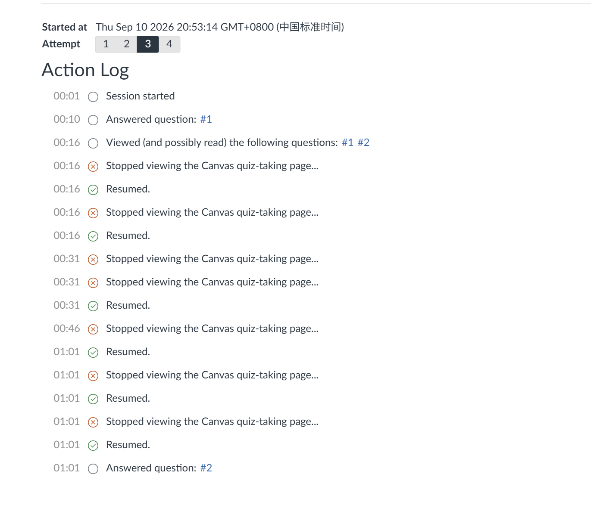
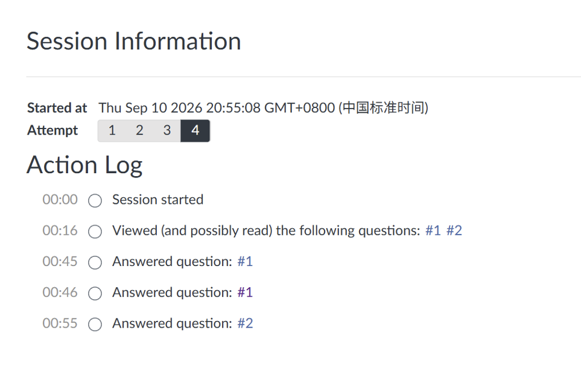

# Canvas Phantom 幻影｜Canvas 黑客技术与页面检测研究

<p align="center"><strong>👻 Canvas Phantom · 幻影</strong><br><strong>减少切屏记录，让正文更干净。</strong><br>浏览器本地运行，一键开启。<br><strong>永久免费 · 无订阅 · 无付费解锁</strong></p>

## 答案看起来全对，为什么 Quiz 却没拿满分？

**为什么在 Canvas 上用 AI 辅助做题，自己觉得能拿满分，最后却只拿到一半？**

**试试 Canvas Phantom：你专注作答，它负责页面体验。** 少些切屏记录，少些正文干扰，永久免费。

<sub>满分取决于答案、评分标准和课程要求。本插件不修改成绩，也不承诺提分；扣分原因以教师反馈为准。</sub>

## 使用前 / 使用后

| P1 · 使用前 | P2 · 使用后 |
| :---: | :---: |
|  |  |
| 离开、返回，多条记录出现在日志里。 | 这次测试中，日志里没有出现这些离开 / 返回记录。 |

<sub>维护者提供的两次测试原图（不同 Attempt）。效果取决于网站的记录方式；不承诺所有网站都检测不到。</sub>

## 不必每月付费，Canvas Phantom 永久免费

| | 商业插件示例：CanvasCrack | **Canvas Phantom · 幻影** |
| :--- | :---: | :---: |
| 月费 | **US$9.99 / 月**（当前促销价） | **US$0 · 永久免费** |
| 使用方式 | 月度订阅方案 | **无需订阅、无需购买激活码** |

**本项目坚持永久免费，不收月费，不设置付费解锁。**

<sub>价格依据：[CanvasCrack 官网月度方案](https://canvascrack.com/en)，查询日期 2026-09-12；仅比较此商业方案，非所有插件的统一价格。商业产品价格可能变化，功能组合也不完全相同。</sub>

---

**少些切屏记录，少些正文干扰。** Canvas Phantom 针对支持的页面记录方式进行拦截，整理正文里看不见的额外文字。装进浏览器，打开开关即可使用，不需要账号，也不需要交月费。

搜索“Canvas 破解”或“Canvas 黑客插件”来到这里？**先看上面的前后对比，再下载体验。** 本项目聚焦页面记录与正文整理，不做付费授权破解。

> 仓库：[xzhe5201314-dot/canvas-phantom](https://github.com/xzhe5201314-dot/canvas-phantom)。维护者显示名：Lagebattoo。搜索引擎收录与排名不作保证。
> 当前仓库版本 **0.1.5**，安装后显示 **Canvas Phantom · 幻影**。

## 它能帮你做什么

| 你得到的效果 | 怎么用 |
| --- | --- |
| **减少切屏记录** | 对支持的页面记录方式进行拦截；上方使用后截图未出现离开 / 返回记录。 |
| **正文更干净** | 整理支持区域里看不见的额外文字，减少正文干扰。 |
| **打开就能用** | 普通网页自动接入，支持符合条件的内嵌页面，无需逐站点添加。 |
| **一键掌控** | 总开关和独立开关随时可用，页面工具栏可拖动，不必反复打开设置。 |
| **状态看得见** | 当前是否运行、处理了多少、有没有冲突，都能在面板里查看。 |

<details>
<summary>开发者细节与适用范围（点击展开）</summary>

| 功能 | 实际实现与边界 |
| --- | --- |
| 焦点／可见性处理 | 处理当前文档的部分可见性属性和焦点状态；过滤指定的 Window、Document、Element 监听注册及指定移除调用。并非所有事件都被过滤。 |
| 网页与 iframe | 匹配普通 HTTP/HTTPS 页面；在 Chrome 允许注入的框架中运行，包括满足来源回退条件的部分空白、srcdoc 等文档。不是对所有框架无条件生效。 |
| 隐藏文本清理 | 只检查指定 Canvas 作业／测验正文区域内、视觉不可见且符合条件的文本节点；保留可恢复节点，最多 500 个，不会清除整个网站的所有隐藏内容。 |
| 浮动工具栏 | 顶层页面快捷开关，支持拖动与键盘移动；子框架不重复显示工具栏。 |
| 状态面板 | 展示运行状态、处理计数、可查询框架及恢复冲突。开关亮起不等于网站没有记录事件。 |

被拒绝的网页监听注册不会补播，关闭后刷新页面才能重建；被其他脚本接管的属性或被页面移走的节点可能不能原地恢复。

</details>

它不是自动答题器，也不解锁付费服务；当前版本没有解除网站“禁止复制”的功能。

## 0.1.5 界面更新

扩展名称、弹窗、CP 标识、工具栏与状态面板统一为 **Canvas Phantom · 幻影**。已有开关设置保留，核心功能不变。

已加载本地版本：更新同一文件夹后，在 `chrome://extensions` 点击该扩展的“重新加载”，再关闭并重新打开弹窗；保存网页输入后刷新网页以更新工具栏。

仓库主分支现为 0.1.5；旧的 v0.1.4 Release 保留原样。获取新界面请使用 **Code → Download ZIP** 中的 `extension` 文件夹。

## 安装

要求：Chrome 120 或更高版本，且浏览器允许加载开发者扩展。

1. 从 [Releases](https://github.com/xzhe5201314-dot/canvas-phantom/releases) 下载发布包，或使用仓库 Code → Download ZIP；解压后找到 `extension` 文件夹。
2. 打开 `chrome://extensions`，开启“开发者模式”。
3. 选择“加载已解压的扩展程序”，选择 **包含 manifest.json 的 extension 文件夹**，不要选择 ZIP 或仓库最外层。
4. 查看浏览器展示的网页访问权限；安装后保存页面输入，再刷新需要使用的网页。
5. 如果使用单独安装包 `canvas-phantom-0.1.4-extension.zip`，解压后直接选择包含 `manifest.json` 的那一层文件夹。

这是手动安装包，不是 Chrome 商店上架版本。不要与旧版本重复启用，以免双方同时修改页面；保留旧版本作对照时可先将其停用。

## 开关与恢复

- 首次使用，主要功能和配套界面默认开启；已有用户保留上次保存的设置。
- 普通 HTTP/HTTPS 网页自动匹配，不需要逐个添加站点。Chrome 内部页面、扩展商店等受保护页面不适用。
- **总开关说了算**：关闭即停止核心处理；工具栏可以保留，方便你再次开启。
- 关闭工具栏或状态面板不等于关闭核心功能。
- **关闭后想恢复网页原来的行为？先保存输入，再刷新页面。** 部分处理不会在关闭瞬间自动重建。
- 页面输入或操作异常时，关闭总开关并刷新；必要时在扩展管理页停用。

## 权限与数据

| 权限 | 用途 |
| --- | --- |
| `storage` | 保存本地开关等设置。 |
| `scripting` | 注册页面脚本、查询及同步各文档中的运行状态。 |
| `activeTab` | 配合弹窗处理当前标签页操作。 |
| `http://*/*`、`https://*/*` | 在符合条件的网页及框架中自动运行。访问范围较广，请按需要使用总开关。 |

当前代码无账号登录、远程 AI 请求和遥测上传实现，也不请求 cookies 权限。扩展会在获准网页内处理 DOM；没有 cookies 权限不代表扩展没有网页访问能力。详细说明见 [PRIVACY.md](PRIVACY.md)。

## 开发与验证

无需 npm 依赖、构建步骤或账号。安装 Node.js 18+ 后，在仓库根目录执行：

```sh
node --test tests/core.test.cjs
```

也可以运行 `npm test`。这里包含 13 项配置、权限、品牌显示、源码静态检查和 JavaScript 编译测试；不是完整的浏览器端回归，也不是线上检测绕过测试。

`SHA256SUMS.txt` 列出发布副本的文件哈希（不包含自身）。0.1.5 仅统一品牌显示与版本信息；核心处理、权限和设置字段保持不变。

## 许可证

[MIT 许可证](LICENSE)适用于 Lagebattoo 有权授权的独立贡献。第三方复用部分不因该许可证而重新授权，其相应权利与许可仍需单独核对；因此本包不宣称所有内容均已获得 MIT 授权。

维护仓库：`xzhe5201314-dot/canvas-phantom`。Topics：`canvas-lms`、`chrome-extension`、`browser-security`、`privacy`、`security-research`。
